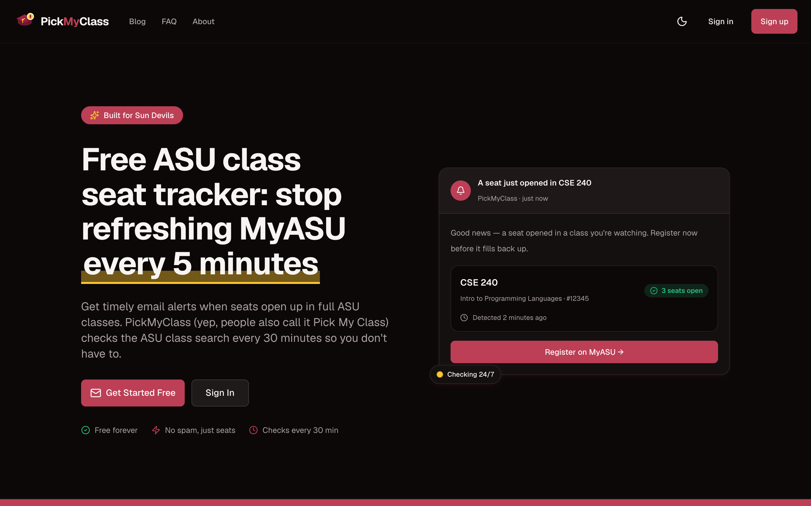

# PickMyClass



A high-performance, scalable class seat notification system for university students. Monitor class availability, get notified when seats open up, and track instructor assignments.

Built with vinext (Vite-based Next.js), PlanetScale Postgres via Cloudflare Hyperdrive + Clerk, and deployed on Cloudflare Workers for edge performance. See `CLAUDE.md` (authoritative map) and `docs/adr/0012-auth-plane-clerk.md` / `0013-data-access-hyperdrive.md` / `0014-realtime-to-polling.md`.

## Features

- **Seat Monitoring** - Track when seats become available in full classes
- **Instructor Tracking** - Get notified when "Staff" instructors are assigned to specific professors
- **Polling Live States** - Dashboard polls `GET /api/class-watches/states` every 30–60s (Realtime removed; data only changes on 30-min cron)
- **Email Notifications** - Instant email alerts via Cloudflare Email Service when changes are detected
- **Smart Deduplication** - Prevents duplicate notifications using atomic PostgreSQL operations
- **Scalable Queue Processing** - Handles 10,000+ users with parallel Cloudflare Queues
- **30-Minute Checks** - Automated checks via Cloudflare Workers Cron Triggers

## Why Cloudflare Workers?

### Edge-First Architecture
- **Global Distribution**: Code runs in 300+ data centers worldwide
- **No Cold Starts**: Workers are always warm, sub-100ms
- **Smart Placement**: Automatic routing to nearest data center

### Cost Efficiency
- **Generous Free Tier**: 100,000 requests/day free
- **Pay-Per-Use**: Only pay for actual compute time

### Native Primitives for Scalability
- **Cloudflare Queues**: Reliable message queue for processing class checks at scale
- **Durable Objects**: Distributed coordination for cron locks (CronLockDO)
- **Hyperdrive**: Postgres connection pooling to PlanetScale (`pg` 8.23, `--caching-disabled`, 5-conn pool in `lib/db/client.ts`)
- **Clerk**: Edge JWT verification (`@clerk/backend` `authenticateRequest` with `jwtKey` PEM, `ext_id` claim) + webhook `user.created/updated/deleted` (`lib/auth/clerk-session.ts`, `lib/db/users.ts` mirror)
- **Workers KV**: Edge caching for disposable-email blocklist (`PICKMYCLASS_DISPOSABLE_DOMAINS`)

## Architecture

```
User Browser
      |
      v
vinext App (Cloudflare Workers) <---> PlanetScale Postgres via Hyperdrive (pg, polling)
      |         |                               ^
      |         | Clerk FAPI (clerk.*)          | polling GET /api/class-watches/states
      v         v                               | (30–60s, sectionRefKey)
Cloudflare Cron (every 30 min + daily at 4 AM)  |
      |
      v
CronLockDO (Durable Object) - prevents duplicate executions
      |
      v
Cloudflare Queue (pickmyclass-queue)
      |
      v
Queue Consumers (20 concurrent Workers)
      |
      v
worker.ts queue() -> processSection() (direct call, no HTTP)
      |
      v
ASU Class Search API (direct HTTP calls)
      |
      v
Change Detection --> Cloudflare Email Service --> User Notifications
```

### Key Components

| Component | Purpose |
|-----------|---------|
| `worker.ts` | Custom Cloudflare Worker with cron, queue handlers, and Durable Objects |
| `lib/worker/cron-lock.ts` | Cron lock lifecycle, status semantics, and Durable Object client |
| `lib/worker/edge-html-cache.ts` | Edge HTML cache eligibility, keying, lookup, and storage rules |
| `app/api/cron/route.ts` | Cron job entry point - enqueues sections to queue |
| `app/api/queue/process-section/route.ts` | HTTP mirror of the queue consumer (tests/HTTP dispatch; not the production path) |
| `lib/db/client.ts` | Hyperdrive `pg` Pool + `setConnectionStringGetter` seam |
| `lib/db/queries.ts` | Database query helpers (SECURITY DEFINER RPCs via `pg`) |
| `lib/db/users.ts` | Clerk user mirror (`clerk_user_id`, `upsertUserFromClerkWebhook`) |
| `lib/auth/clerk-session.ts` | Edge JWT verify (`getSessionIdentity`, `revokeSession`, `revokeAllUserSessions`) |
| `lib/auth/clerk-cookies.ts` | Clerk cookie prefix detection + `CLERK_COOKIES_TO_CLEAR` |
| `lib/clerk/config.ts` | Committed `CLERK_PUBLISHABLE_KEY` literal + CSP |
| `lib/asu/api.ts` | ASU Class Search API client (direct HTTP) |
| `lib/queue/process-section.ts` | Section processing orchestrator |
| `lib/queue/dlq-consumer.ts` | Dead Letter Queue consumer |
| `lib/queue/change-detector.ts` | Change detection logic |
| `lib/queue/notification-sender.ts` | Notification sending with atomic deduplication |
| `lib/email/send.ts` | Cloudflare Email Service batch sender |
| `lib/class-watches/class-watch-creation.ts` | Browser-side watch creation policy and transport |
| `lib/cache/ttl-cache.ts` | TTL cache for ASU API responses |
| `lib/api/schemas.ts` | Queue message validation schemas |
| `proxy.ts` | vinext middleware — auth gate (Clerk), redirects, security headers + CSP (see `lib/auth/decide-gate.ts`) |
| `lib/auth/disposable-email.ts` | Disposable email validation |
| `app/sign-in/[[...sign-in]]/page.tsx`, `app/sign-up/[[...sign-up]]/page.tsx` | Clerk hosted `<SignIn>`/`<SignUp>` components (`routing="path"`) |

### API Routes

| Route | Methods | Description |
|-------|---------|-------------|
| `app/api/auth/signout/route.ts` | POST | Sign out (`clerk.signOut` + `revokeSession` + clear `CLERK_COOKIES_TO_CLEAR`) |
| `app/api/auth/consent/route.ts` | POST | Record `age_verified`/`agreed_to_terms` |
| `app/api/webhooks/clerk/route.ts` | POST | Svix `verifyWebhook` (`whsec_...`) → `upsertUserFromClerkWebhook` (`user.created/updated/deleted`) |
| `app/auth/post-oauth/route.ts` | GET | OAuth consent + `ensureUserMirror` |
| `app/api/class-watches/route.ts` | GET, POST, DELETE | Create, read, and delete class watches (no update) |
| `app/api/class-watches/states/route.ts` | GET | Polling endpoint for live class states |
| `app/api/cron/route.ts` | GET | Cron job entry - enqueues sections with staggered groups and Durable Object lock |
| `app/api/cron/update-disposable-domains/route.ts` | GET | Daily sync of disposable email domain blocklist |
| `app/api/fetch-class-details/route.ts` | POST | Fetch class details from ASU API and persist state |
| `app/api/monitoring/health/route.ts` | GET | System health check (DB, ASU API, Cron Lock, email, config) |
| `app/api/queue/process-section/route.ts` | POST | HTTP mirror of the queue consumer (tests/HTTP dispatch) |
| `app/api/unsubscribe/route.ts` | GET, POST | CAN-SPAM/RFC 8058 compliant email unsubscribe |
| `app/api/user/delete/route.ts` | DELETE | Soft-delete account (CCPA, 30-day retention) |
| `app/api/user/export/route.ts` | GET | Export all user data in JSON (CCPA) |
| `app/api/user/onboarding/route.ts` | GET, POST | Onboarding state (`pending→skipped→completed`) |
| `app/api/onboarding/popular-class/route.ts` | GET | `get_most_watched_class` → ASU validate → `popularClass: null` fail-open |

### Durable Objects

**CronLockDO** - Prevents duplicate cron executions
- Auto-expires after 25 minutes
- Ensures only one cron job runs at a time across all isolates

## Self-Hosting Guide

### Prerequisites

- [pnpm](https://pnpm.io/) 11.10.0
- [PlanetScale](https://planetscale.com/) Postgres (PS-5) + Cloudflare Hyperdrive (`--caching-disabled`)
- [Clerk](https://clerk.com/) (Hobby free ≤50k MRU) — OAuth app for Google, custom domain `clerk.your-domain.com`
- [Cloudflare Account](https://cloudflare.com/) (Workers, Queues, KV, Email Service)
- ASU API access (`ASU_API_BASE_URL` + `ASU_API_TOKEN`)

### 1. Clone and Install

```bash
git clone https://github.com/yourusername/pickmyclass.git
cd pickmyclass
pnpm install
```

### 2. Set Up PlanetScale + Hyperdrive

2. Apply migrations (`db/migrations/*.sql` — vanilla PG; last definition wins; `SET search_path=public` + `REVOKE/GRANT` for `SECURITY DEFINER` funcs).
3. Create Hyperdrive:
   ```bash
   wrangler hyperdrive create HYPERDRIVE \
     --connection-string="postgres://YOUR_PLANETSCALE_CONNECTION_STRING" \
     --caching-disabled
   ```
   Note `binding` `HYPERDRIVE`, id `4dd6f09...` in `wrangler.jsonc`. Local dev fallback: `CLOUDFLARE_HYPERDRIVE_LOCAL_CONNECTION_STRING_HYPERDRIVE`.

### 3. Configure Clerk

1. Create Clerk production instance; set `NEXT_PUBLIC_CLERK_PUBLISHABLE_KEY` (`pk_live_...`) literal in `lib/clerk/config.ts` (and `CLERK_CSP` if custom domain).
2. Sessions → Customize token → `{"ext_id":"{{user.external_id || user.id}}"}` (short ID `ext_id` is the app’s `user_id`).
3. Webhooks → Add Endpoint `https://your-domain.com/api/webhooks/clerk` (events `user.created/updated/deleted`, secret `whsec_...`).
4. Social Connections → Google → Client ID/Secret (Cloud Console redirect `https://clerk.your-domain.com/v1/oauth_callback`, origins `https://your-domain.com` + `https://clerk.your-domain.com`).
5. DNS: CNAME `clerk` → `frontend-api.clerk.services` (grey-cloud DNS-only) — verify `dig @1.1.1.1 clerk.your-domain.com CNAME` + `curl --resolve clerk...:443:IP https://clerk.your-domain.com/v1/client` → `405` with `x-clerk-trace-id`.

### 4. Configure Environment Variables

Copy `.env.example` to `.env.local` (or `.dev.vars` for `wrangler dev`):

| Variable | Description | Where to Get It |
|----------|-------------|-----------------|
| `NEXT_PUBLIC_CLERK_PUBLISHABLE_KEY` | Clerk publishable key (`pk_live_...`) | Clerk Dashboard → API Keys (also literal in `lib/clerk/config.ts`) |
| `CLERK_SECRET_KEY` | Clerk secret key (`sk_live_...`) | Clerk Dashboard → API Keys |
| `CLERK_JWT_KEY` | Clerk session PEM (`-----BEGIN PUBLIC KEY-----...`) | Clerk Dashboard → API Keys → bottom JWT public key/PEM |
| `CLERK_WEBHOOK_SIGNING_SECRET` | Svix webhook secret (`whsec_...`) | Clerk Dashboard → Webhooks → Signing Secret |
| `ASU_API_BASE_URL` | Base URL for ASU Class Search API | ASU API endpoint |
| `ASU_API_TOKEN` | Auth token for ASU API | ASU (external) |
| `CRON_SECRET` | Auth for cron endpoint | `openssl rand -hex 32` |
| `NOTIFICATION_FROM_EMAIL` | Sender address for email notifications | Cloudflare Email Service-enabled sender |
| `UNSUBSCRIBE_SIGNING_SECRET` | Signs unsubscribe tokens (CAN-SPAM, 90-day expiry) | `openssl rand -hex 32` |

### 5. Set Cloudflare Secrets

```bash
wrangler secret put CLERK_SECRET_KEY
wrangler secret put CLERK_PUBLISHABLE_KEY
wrangler secret put CLERK_JWT_KEY
wrangler secret put CLERK_WEBHOOK_SIGNING_SECRET
wrangler secret put ASU_API_BASE_URL
wrangler secret put ASU_API_TOKEN
wrangler secret put CRON_SECRET
wrangler secret put UNSUBSCRIBE_SIGNING_SECRET
```

### 6. Deploy

```bash
pnpm run deploy   # vinext build + wrangler deploy + wrangler triggers deploy
```

App live at `https://your-worker.workers.dev` or custom domain.

### 7. Set Up Cloudflare Queues

Queues `pickmyclass-queue` + `pickmyclass-dlq` are created by `wrangler deploy` (via `wrangler.jsonc` `queues`). Verify in Dashboard → Workers & Pages → Queues.

### 8. Customize Legal Pages (Optional)

The `app/legal/` directory contains Terms/Privacy with `support@pickmyclass.app`. Update contact emails in `app/legal/page.tsx`, `app/legal/terms/page.tsx`, `app/legal/privacy/page.tsx` for your jurisdiction.

### 9. Verify Deployment

- Health: `https://your-domain.com/api/monitoring/health`
- Smoke (see `docs/runbooks/clerk-cutover.md`): hosted `/sign-up` → email verify in flow → hosted `/sign-in` → Google OAuth lands `/auth/post-oauth` → consent gate → watch create limit (`create_class_watch_with_limit` advisory lock) → cron→queue→processSection→email → unsubscribe HMAC → admin pages → polling

## Development

### Local Development

```bash
pnpm run dev              # vinext dev server (localhost:3000, HYPERDRIVE local string required)
```

### Preview with Cloudflare

```bash
pnpm run preview          # vinext build + wrangler dev (real Worker locally)
```

### Other Commands

```bash
pnpm run build            # Build application
pnpm run lint             # Run Oxlint linter
pnpm run lint:fix         # Fix lint issues
pnpm run format           # Format code with Oxfmt
pnpm run knip             # Find unused exports/dependencies
pnpm run cf-typegen       # Generate TypeScript types for Cloudflare env (lib/cloudflare-env.d.ts)
pnpm run type-check       # tsc --noEmit && tsc -p tsconfig.worker.json --noEmit
```

### Database Commands

```bash
# PlanetScale is vanilla PG: apply db/migrations/*.sql by hand via any Postgres client (psql) — no CLI workflow
```

## Tech Stack

- **Frontend**: vinext (App Router), React 19, TypeScript, Tailwind CSS 4, `@clerk/clerk-react` 5.61.3 via `ClerkClientProvider`, `posthog-js` (public token in `lib/posthog/config.ts`)
- **Backend**: Cloudflare Workers (via vinext), PlanetScale Postgres (`pg` 8.23) via Hyperdrive, Clerk (`@clerk/backend` 3.16.10 edge JWT), Supabase Realtime **removed** (polling only)
- **Data Source**: ASU Class Search API (direct HTTP)
- **Email**: Cloudflare Email Service
- **Deployment**: Cloudflare Workers + Queues + Durable Object (CronLockDO) + KV (disposable domains)

## Project Structure

```
app/                         # App Router
  ├── about/                 # About page
  ├── api/                   # API endpoints (see table above)
  ├── admin/                 # Admin panel (users, classes, dashboard)
  ├── auth/post-oauth/       # OAuth landing (route.ts: mirror repair + consent routing)
  ├── blog/                  # Blog pages (9 posts + RSS feed)
  ├── dashboard/             # Main dashboard with polling updates
  ├── dashboard/add/         # Add class watch page
  ├── faq/                   # FAQ page
  ├── go/[uni]/              # University redirect links
  ├── legal/                 # Legal pages (terms, privacy)
  ├── sign-in/[[...sign-in]]/ # Clerk hosted <SignIn> (path routing)
  ├── sign-up/[[...sign-up]]/ # Clerk hosted <SignUp> (path routing)
  ├── settings/              # User settings
  ├── layout.tsx             # Root layout (ClerkClientProvider)
  └── page.tsx               # Landing page

lib/
  ├── api/                   # API schemas and validation
  ├── asu/                   # ASU Class Search API client
  ├── auth/                  # authorization-state, decide-gate, clerk-session, clerk-cookies, require-user
  ├── blog/                  # Blog posts data
  ├── cache/                 # TTL cache utilities
  ├── clerk/                 # Clerk publishable key literal + CSP
  ├── class-watches/         # Browser-side watch creation seam
  ├── contexts/              # React contexts (Auth compat, Theme)
  ├── db/                    # Hyperdrive pg client + queries + admin-queries + users mirror
  ├── email/                 # Email templates + Cloudflare Email Service
  ├── hooks/                 # React hooks (polling useRealtimeClassStates, pull-to-refresh, swipe)
  ├── queue/                 # Queue processing (change detection, notification sending, DLQ)
  ├── types/                 # TypeScript type definitions
  ├── utils/                 # Utility functions (crypto, rate-my-professor, seat badge, time format)
  └── utils.ts               # shadcn/ui utility (cn function)

components/
  ├── admin/                 # Admin panel components
  ├── blog/                  # Blog components
  ├── landing/               # Landing page components
  ├── ui/                    # shadcn/ui components
  └── ...                    # Feature components (ClerkClientProvider, AuthButton, watch cards)

db/
  └── migrations/            # Database migrations (PG history, timestamp-prefixed)

worker.ts                    # Custom Cloudflare Worker
wrangler.jsonc               # Cloudflare Workers config (HYPERDRIVE, CLERK_* secrets, cron)
```

> **Note:** `lib/utils.ts` is the shadcn/ui utility file (contains the `cn` function), while `lib/utils/` is a directory for custom utility functions. Both coexist by design.

## How It Works

1. **User adds class watch** - Student enters section number on dashboard
2. **Every 30 minutes** - Cloudflare cron triggers enqueue all watched sections (even/odd stagger)
3. **Queue consumers process** - 20 concurrent Workers query ASU API in parallel
4. **Change detection** - Compare new state with PostgreSQL cached state (`non_reserved_seats ?? seats_available`)
5. **Atomic deduplication** - a partial unique index (`is_active=TRUE`) + `try_record_notifications_batch` claims recipients; a daily `expire_stale_notifications()` sweep frees expired slots
6. **Email notification** - Cloudflare Email Service sends alerts for available seats
7. **Dashboard polls** - `useRealtimeClassStates` polls `/api/class-watches/states` (not Realtime)

## Contributing

Contributions are welcome! Please see [CONTRIBUTING.md](CONTRIBUTING.md) for guidelines.

### Quick Start for Contributors

1. Fork the repository
2. Create a feature branch: `git checkout -b feature/my-feature`
3. Make your changes
4. Run linting: `pnpm run lint:fix`
5. Commit with conventional commits: `git commit -m "feat: add new feature"`
6. Push and open a PR

## License

This project is licensed under the MIT License - see the [LICENSE](LICENSE) file for details.

## Acknowledgments

- [vinext](https://github.com/cloudflare/vinext) - Vite-based Next.js for Cloudflare Workers
- [PlanetScale](https://planetscale.com/) + [Hyperdrive](https://developers.cloudflare.com/hyperdrive/) - Postgres + pooling
- [Clerk](https://clerk.com/) - Auth (Backend + clerk-react, custom session claims + webhooks)
- [Cloudflare Email Service](https://developers.cloudflare.com/email/) - Email sending from Workers
- [shadcn/ui](https://ui.shadcn.com/) - UI component library
