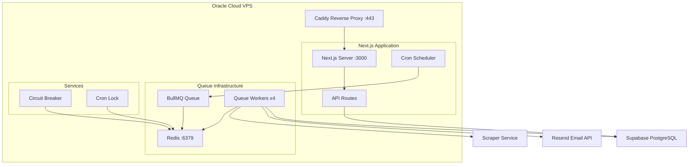

# Design: Workers to VPS Migration

## Overview

Replace Cloudflare Workers-specific infrastructure with standard Node.js solutions running on Oracle Cloud VPS. The architecture uses BullMQ for job queues, Redis for distributed state, and node-cron for scheduled tasks.

## Architecture



## Components

### Component: Next.js Application

**Purpose:** Serve web application and API routes
**Responsibilities:**
- Serve React frontend
- Handle authentication via Supabase
- Provide API endpoints for class watches
- Host cron scheduler (node-cron)
- Expose health check endpoint

**Changes from Current:**
- Remove `@opennextjs/cloudflare` dependency
- Remove `getCloudflareContext()` calls
- Add direct Redis/BullMQ imports
- Standard `next start` deployment

### Component: BullMQ Queue System

**Purpose:** Replace Cloudflare Queues for parallel job processing
**Responsibilities:**
- Accept jobs from cron scheduler
- Process class sections in parallel (4 workers)
- Handle retries (max 3 attempts)
- Route failed jobs to dead letter queue
- Provide job status and metrics

**Configuration:**
```typescript
// lib/queue/config.ts
export const queueConfig = {
  connection: {
    host: process.env.REDIS_HOST || 'localhost',
    port: parseInt(process.env.REDIS_PORT || '6379'),
    password: process.env.REDIS_PASSWORD,
  },
  defaultJobOptions: {
    attempts: 3,
    backoff: {
      type: 'exponential',
      delay: 1000,
    },
    removeOnComplete: 100, // Keep last 100 completed jobs
    removeOnFail: 500,     // Keep last 500 failed jobs
  },
};
```

### Component: Redis State Store

**Purpose:** Replace Durable Objects for distributed state
**Responsibilities:**
- Store circuit breaker state (JSON)
- Manage distributed cron lock
- Provide atomic operations via transactions
- Persist queue jobs

**Redis Key Schema:**
```
pickmyclass:circuit:scraper       # Circuit breaker state JSON
pickmyclass:lock:cron             # Cron distributed lock
pickmyclass:queue:class-check     # BullMQ queue data
pickmyclass:queue:class-check:dlq # Dead letter queue
```

### Component: Circuit Breaker Service

**Purpose:** Protect scraper from cascade failures
**Responsibilities:**
- Track failure/success counts
- Manage state transitions (CLOSED -> OPEN -> HALF_OPEN -> CLOSED)
- Provide check/record API for workers
- Auto-recover after timeout

**State Machine (unchanged from current):**
```
CLOSED ──(10 failures)──> OPEN ──(2 min timeout)──> HALF_OPEN
   ^                                                    │
   │                                                    │
   └────────────(3 successes)───────────────────────────┘
                                                        │
                              (1 failure)───────────────┘
```

### Component: Cron Lock Service

**Purpose:** Prevent concurrent cron executions
**Responsibilities:**
- Acquire lock before cron runs
- Release lock after completion
- Auto-expire after 25 minutes
- Report lock status

**Implementation:**
```typescript
// Redis SET with NX (only if not exists) and PX (expire ms)
await redis.set('pickmyclass:lock:cron', holderId, 'NX', 'PX', 25 * 60 * 1000);
```

### Component: Caddy Reverse Proxy

**Purpose:** HTTPS termination and request routing
**Responsibilities:**
- Automatic SSL via Let's Encrypt
- Proxy requests to Next.js
- HTTP/2 support
- Request logging

**Caddyfile:**
```
pickmyclass.app {
    reverse_proxy localhost:3000
    encode gzip
    log {
        output file /var/log/caddy/access.log
    }
}
```

## Data Flow

### Cron Job Flow

1. node-cron triggers at :00 and :30 minutes
2. Cron handler acquires Redis lock
3. If lock acquired, fetch sections from Supabase
4. Enqueue all sections to BullMQ
5. Release lock
6. Queue workers process jobs in parallel

### Queue Worker Flow

1. Worker pulls job from BullMQ
2. Check circuit breaker state in Redis
3. If OPEN, fail job immediately
4. Call scraper service for class data
5. Record success/failure in circuit breaker
6. Detect changes from previous state
7. Send notifications via Resend
8. Update class_states in Supabase
9. Acknowledge job completion

## Technical Decisions

| Decision | Options | Choice | Rationale |
|----------|---------|--------|-----------|
| Queue System | BullMQ, pg-boss, custom | BullMQ | Production-proven, feature-rich, Redis-based |
| Circuit Breaker | opossum, custom | Custom with Redis | Simpler, matches current behavior exactly |
| Cron Scheduler | node-cron, Agenda, cron | node-cron | Lightweight, no DB needed, in-process |
| Process Manager | PM2, systemd, Docker | PM2 | Easy config, auto-restart, log management |
| Reverse Proxy | Caddy, Nginx, Traefik | Caddy | Auto HTTPS, simple config, low memory |
| Redis Provider | Upstash, VPS Redis, Dragonfly | Upstash | Free tier, managed, low latency |

## File Structure

| File | Action | Purpose |
|------|--------|---------|
| `lib/queue/config.ts` | Create | BullMQ connection and job config |
| `lib/queue/queues.ts` | Create | Queue definitions and helpers |
| `lib/queue/worker.ts` | Create | Queue worker implementation |
| `lib/queue/types.ts` | Create | Job type definitions |
| `lib/redis/client.ts` | Create | Redis connection singleton |
| `lib/redis/circuit-breaker.ts` | Create | Circuit breaker with Redis |
| `lib/redis/cron-lock.ts` | Create | Distributed lock with Redis |
| `lib/cron/scheduler.ts` | Create | node-cron setup and job registration |
| `lib/cron/class-check.ts` | Create | Cron job handler (refactored from route) |
| `worker.ts` | Delete | No longer needed (Cloudflare-specific) |
| `wrangler.jsonc` | Delete | No longer needed |
| `lib/types/queue.ts` | Modify | Update for BullMQ types |
| `lib/cloudflare-env.d.ts` | Delete | No longer needed |
| `app/api/cron/route.ts` | Modify | Remove CF context, call shared handler |
| `app/api/queue/process-section/route.ts` | Delete | Logic moves to worker |
| `app/api/monitoring/health/route.ts` | Modify | Use Redis for status checks |
| `package.json` | Modify | Update dependencies |
| `ecosystem.config.js` | Create | PM2 configuration |
| `Caddyfile` | Create | Reverse proxy configuration |
| `start.sh` | Create | Startup script for VPS |

## Error Handling

| Error | Handling | User Impact |
|-------|----------|-------------|
| Redis connection failure | Retry with backoff, log, fail cron | Delayed notifications |
| Queue worker crash | PM2 auto-restart, job retry | Minor delay |
| Circuit breaker OPEN | Skip scraper calls, log | Delayed notifications (2 min) |
| Scraper timeout | Record failure, retry job | Retry after backoff |
| Supabase error | Log, fail job, retry | Retry after backoff |
| Resend rate limit | Batch with delays | Minor email delay |

## Existing Patterns to Follow

1. **Service Client Pattern** (`lib/supabase/service.ts`):
   - Singleton client initialization
   - Environment variable validation
   - Graceful handling when not configured

2. **Atomic Notification Deduplication** (`lib/db/queries.ts`):
   - `tryRecordNotification()` pattern unchanged
   - PostgreSQL function for race-condition safety

3. **Batch Email Sending** (`lib/email/resend.ts`):
   - Chunk emails into batches of 100
   - Handle partial failures
   - Rate limiting with delays

4. **Health Check Structure** (`app/api/monitoring/health/route.ts`):
   - Check each service independently
   - Return aggregate status (healthy/degraded/unhealthy)
   - Include latency metrics

## Migration Strategy

### Phase 1: Infrastructure Setup
- Provision Oracle Cloud VPS
- Install Node.js, Redis, Caddy, PM2
- Configure firewall and networking

### Phase 2: Code Migration
- Create new lib/queue, lib/redis, lib/cron modules
- Modify API routes to use new services
- Remove Cloudflare-specific code
- Update package.json dependencies

### Phase 3: Testing
- Deploy to VPS with test domain
- Run integration tests
- Verify notification flow end-to-end
- Load test with simulated watches

### Phase 4: Cutover
- Configure production domain in Caddy
- Update DNS to point to VPS
- Monitor for 24 hours
- Decommission Cloudflare Workers

### Rollback Plan
1. Update DNS back to Cloudflare
2. Cloudflare Workers remain unchanged
3. Data in Supabase is shared, no sync needed
4. Rollback time: < 5 minutes (DNS propagation)

## Security Considerations

1. **Environment Variables:**
   - Store all secrets in `.env` file
   - Never commit secrets to git
   - Use PM2 ecosystem config for env management

2. **Redis Security:**
   - Password-protected connection
   - No public exposure (localhost only or Upstash)
   - TLS for Upstash connections

3. **Network Security:**
   - UFW firewall: allow 22, 80, 443 only
   - Caddy handles HTTPS
   - Internal services on localhost

4. **Process Isolation:**
   - Run as non-root user
   - PM2 cluster mode for isolation
   - Resource limits in ecosystem.config.js

## Monitoring and Observability

1. **Health Endpoint:** `/api/monitoring/health`
   - Database connectivity
   - Redis connectivity
   - Queue metrics (pending, failed, completed)
   - Circuit breaker state
   - Last cron execution time

2. **Logging:**
   - PM2 log files in `/var/log/pickmyclass/`
   - Caddy access logs
   - Application logs with timestamps

3. **External Monitoring:**
   - UptimeRobot for health endpoint
   - Alert on degraded/unhealthy status
